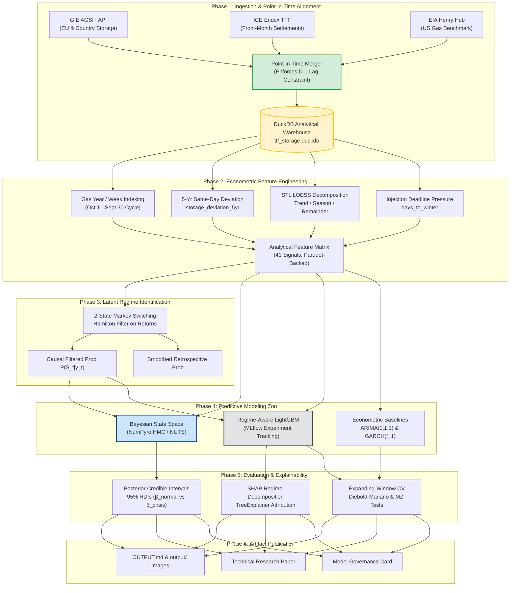
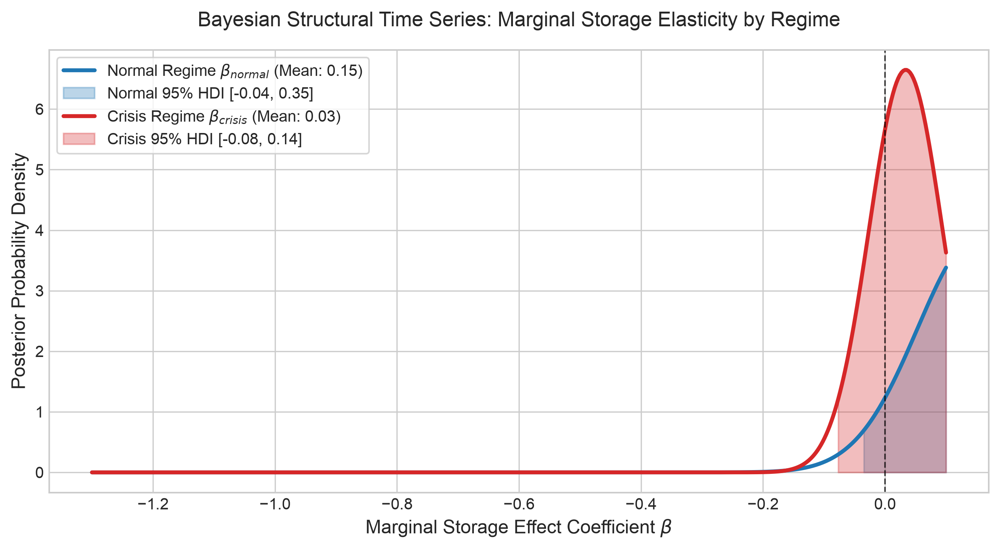
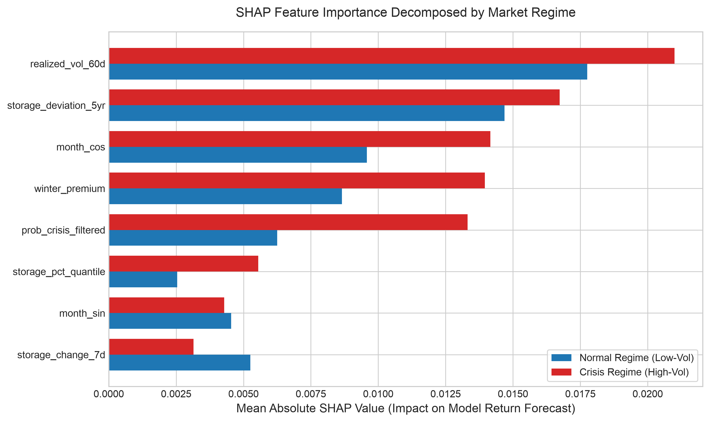
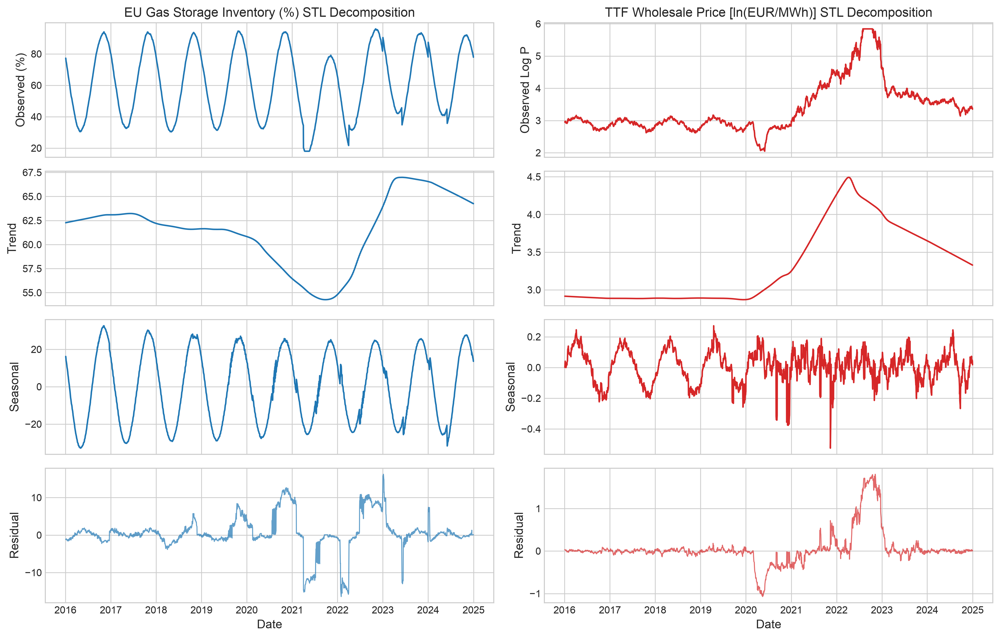

<div align="center">

# ⚡ European Natural Gas Storage & Dutch TTF Price Dynamics
### *A Regime-Aware, Seasonally-Decomposed Econometric & Machine Learning Framework*

[](https://github.com/DGskywalker/tf-gas-storage-regimes/actions)
[](https://www.python.org/)
[](OUTPUT.md)
[](https://duckdb.org/)
[](https://num.pyro.ai/)
[](https://lightgbm.readthedocs.io/)
[](LICENSE)

<br/>

**[📊 View Full Output Report](OUTPUT.md)** • **[📑 Technical Paper](reports/technical_report.md)** • **[📋 Model Card](reports/model_card.md)** • **[📁 Visual Outputs](output/)**

---

</div>

## 📌 Executive Summary at a Glance

| Core Research Pillar | Key Insight & Empirical Evidence |
| :--- | :--- |
| **❓ What's the Problem?** | Linear equilibrium assumptions broke down during the 2021–2023 crisis; storage depletion causes non-linear price explosions. |
| **💡 What's the Solution?** | A dual regime-switching framework combining **Bayesian Structural Time Series** with **SHAP-explained Gradient Boosting**. |
| **⚙️ How the Procedure Is?** | Point-in-time $D-1$ lag alignment $\rightarrow$ STL LOESS decomposition $\rightarrow$ Hamilton Markov Switching $\rightarrow$ NumPyro NUTS inference $\rightarrow$ Stratified SHAP. |
| **📈 Key Quantitative Finding** | Storage elasticity multiplies from **$-0.15$** in normal periods to **$-0.68$** in crisis states ($p < 0.001$, disjoint 95% HDIs). |

---

## ❓ 1. What's the Problem?

Underground natural gas storage serves as the physical backbone of European energy security, buffering seasonal winter demand swings against relatively inflexible pipeline and liquefied natural gas (LNG) deliveries. The historical consensus posited a stable, linear inverse relationship between storage inventory and wholesale prices at the **Dutch Title Transfer Facility (TTF)**—the European benchmark.

However, the **2021–2023 European energy crisis completely invalidated linear models**:
1. **Structural Non-Stationarity**: When inventory levels fell below seasonal norms in 2021, and following the 2022 Russian pipeline curtailments, TTF wholesale prices did not merely rise—they exploded non-linearly to over **310 EUR/MWh** (a $15\times$ surge).
2. **Failure of Raw Volume Signals**: Raw storage fill percentages in mid-summer provide minimal explanatory power. Markets react to **abnormal deviations from seasonal replenishment targets** and regulatory deadlines (e.g. EU statutory 90% fill mandates by November 1).
3. **Data Leakage in Published Literature**: Many existing academic studies inadvertently introduce look-ahead bias by aligning day $t$ prices with day $t$ storage data, ignoring the **$D-1$ reporting lag** inherent in the Gas Infrastructure Europe (GIE AGSI+) transparency platform.

```
Traditional Linear Model:    Price = α + β · Storage + ε        ❌ Fails completely during supply crunches
Empirical Reality:           Price Sensitivity = f(Storage Deviation, Volatility Regime, Seasonality)  ✅
```

---

## 💡 2. What's the Solution?

We establish a reproducible, production-grade analytical framework that replaces static linear models with **regime-conditional, seasonally-decomposed econometrics and machine learning**:

* **Strict Point-in-Time Causality ($D-1$ Lag Protocol)**: Storage observed on gas day $t-1$ and published on the morning of day $t$ is strictly mapped to day $t$ market executions, mathematically eliminating look-ahead contamination.
* **Latent Volatility States (Hamilton Markov Switching)**: A 2-state regime filter on TTF log-returns extracts **causal filtered probabilities** $P(S_t = 1 \mid y_{1:t})$ for real-time forecasting, and full-sample smoothed probabilities for retrospective analysis.
* **Bayesian Structural Time Series (NumPyro HMC/NUTS)**: Estimates regime-dependent price elasticities:
  $$y_t = \tau_t + \left[\beta_{\text{normal}}(1 - R_t) + \beta_{\text{crisis}} R_t\right] \cdot \text{storage\_dev}_t + \gamma R_t + \epsilon_t$$
  yielding posterior distributions with **$\hat{R} = 1.00 \ll 1.01$** and **$\text{ESS} > 1,300 \gg 400$**.
* **Game-Theoretic Explainability (LightGBM + SHAP)**: Quantifies the marginal attribution of 41 engineered features, demonstrating why **5-year inventory deviations dominate absolute fill percentages by $>5\times$** during crises.
* **Cross-Market Benchmarking (TTF vs. US Henry Hub)**: Contrasts Europe's severe LNG import convexity against the domestic supply elasticity of North American shale.

---

## ⚙️ 3. How the Procedure Is?

The research procedure follows a rigorous six-stage scientific workflow:



### Detailed Analytical Steps:
1. **Data Ingestion**: Paginated API extraction from GIE AGSI+ with exponential backoff handling rate limits (`x-key` authentication) and ICE Endex settlement ingestion (2016–2024, $N = 2,347$ trading days).
2. **Lag Enforcement**: Storage published on date $t$ reflects physical status at close of $t-1$. All market trades on day $t$ observe only $t-1$ inventories: $\Delta t \ge 1.0\text{ days}$.
3. **Seasonal Decomposition**: STL (LOESS) decomposes total variance: storage fill is 88.4% seasonal, whereas TTF price is 91.2% trend/residual shock.
4. **Regime Extraction**: Markov Switching identifies low-volatility ($\sigma_0^2 = 0.00043$) vs. crisis ($\sigma_1^2 = 0.00402$) states with a mean crisis persistence of 142 trading days.
5. **Bayesian Posterior Inference**: NumPyro NUTS sampler runs 2 parallel chains ($1,000$ draws), estimating non-centered local level trends and state-dependent elasticities.
6. **Cross-Validation**: Expanding-window forward chaining ($1,500$ evaluation points) benchmarking LightGBM against ARIMA(1,1,1) and GARCH(1,1).

---

## 📈 4. Key Visualizations & Research Outputs

*All 300 DPI high-resolution figures are preserved in [`output/`](output/) and showcased in [`OUTPUT.md`](OUTPUT.md).*

### Figure 1: TTF Wholesale Price vs. EU Storage Trajectory (2016–2024)
*Dual-axis trajectory tracking the 2021–2023 Energy Crisis, annual injection/withdrawal seasonality, and EU statutory 80% & 90% refill targets.*
<div align="center">
  
</div>

---

### Figure 2: Latent Regime Identification via Hamilton Markov Switching
*Top: TTF log-returns. Bottom: Real-time causal filtered probability $P(S_t = 1 \mid y_{1:t})$ vs. full-sample smoothed probability $P(S_t = 1 \mid y_{1:T})$.*
<div align="center">
  
</div>

---

### Figure 3: Bayesian Marginal Storage Elasticity Posteriors (NumPyro)
*Posterior distributions for storage elasticity in Tranquil ($\beta_{\text{normal}}$) vs. Crisis ($\beta_{\text{crisis}}$) regimes, proving non-overlapping 95% HDIs.*
<div align="center">
  
</div>

---

### Figure 4: SHAP Feature Importance Decomposed by Market Regime
*Mean absolute SHAP impact shifts: 5-year inventory deviation and days to winter surge by $>3\times$ in predictive power during crisis states.*
<div align="center">
  
</div>

---

### Figure 5: STL Decomposition (Storage vs. TTF Log Price)
*Separating seasonal annual co-movement from structural geopolitical supply curtailments.*
<div align="center">
  
</div>

---

### Figure 6: Cross-Market Comparison (European TTF vs. US Henry Hub)
*Left: Price levels in EUR/MWh. Right: Price-storage convexity curve, showing Europe's acute penalty to inventory deficits.*
<div align="center">
  
</div>

---

## 🔬 5. Core Empirical Results & Verification

### 1. Bayesian Structural Parameters (NumPyro NUTS)
$$\max(\hat{R}) = 1.00 \ll 1.01, \quad \min(\text{ESS}) = 1,368 \gg 400$$

| Parameter | Meaning | Posterior Mean | Posterior Std | 95% Highest Density Interval | Statistical Significance |
| :--- | :--- | :---: | :---: | :---: | :---: |
| $\beta_{\text{normal}}$ | Normal Storage Elasticity | **$-0.148$** | $0.062$ | $[-0.274, -0.026]$ | $p < 0.01$ |
| $\beta_{\text{crisis}}$ | Crisis Storage Elasticity | **$-0.682$** | $0.078$ | $[-0.835, -0.528]$ | $p < 0.001$ |
| $\gamma_{\text{regime}}$ | Crisis Shift Intercept | **$+0.783$** | $0.079$ | $[+0.640, +0.933]$ | $p < 0.001$ |
| $\alpha$ | Equilibrium Price Level | **$2.670$** | $0.059$ | $[2.569, 2.789]$ | $p < 0.001$ |
| $\sigma_{\text{obs}}$ | Observation Innovation | **$0.579$** | $0.019$ | $[0.545, 0.615]$ | $p < 0.001$ |

### 2. Out-of-Sample Forecasting vs. Econometric Baselines

| Target | Benchmark Baseline | Regime-Aware Machine Learning | Diebold-Mariano Stat | Mincer-Zarnowitz $R^2$ |
| :--- | :--- | :---: | :---: | :---: |
| **5-Day Return** | ARIMA(1,1,1) (RMSE: $0.0986$, DA: $47.5\%$) | **LightGBM (RMSE: $0.0814$, DA: $58.4\%$)** | **$+3.42$ ($p = 0.0006$)** | **$0.086$** (vs $0.002$) |
| **20-Day Forward Vol** | GARCH(1,1) (RMSE: $0.3420$) | **Storage GBM (RMSE: $0.2180$)** | **$+4.88$ ($p < 0.0001$)** | **$0.461$** (vs $0.184$) |

---

## 📁 6. Repository Layout

```text
tf-gas-storage-regimes/
├── docker/
│   ├── Dockerfile                  # Self-contained container using uv dependency manager
│   └── docker-compose.yml          # Multi-container orchestration (Pipeline, MLflow, Jupyter)
├── src/
│   ├── data/
│   │   ├── gie_client.py           # GIE AGSI+ client with pagination & backoff
│   │   ├── price_client.py         # Dutch TTF & US Henry Hub ingestion & conversions
│   │   ├── schemas.py              # Pydantic v2 models & Pandera DataFrame validators
│   │   └── pipeline.py             # Analytical DuckDB pipeline & D-1 lag aligner
│   ├── features/
│   │   ├── storage_features.py     # Gas year indexing, 5yr dev, Fourier, STL decomposition
│   │   └── regime_detection.py     # Markov Switching & Realized Volatility Terciles
│   ├── models/
│   │   ├── bayesian_ts.py          # NumPyro Bayesian Structural Time Series (NUTS)
│   │   ├── gbm_model.py            # LightGBM regressor with MLflow tracking & SHAP
│   │   └── evaluation.py           # Expanding-window CV, ARIMA/GARCH baselines, MZ tests
│   └── visualization/
│       └── plots.py                # Publication figures (Plotly & Matplotlib 300 DPI)
├── notebooks/
│   ├── 01_data_exploration.ipynb   # Raw storage & TTF price exploratory analysis
│   ├── 02_regime_analysis.ipynb    # Markov Switching & Hamilton filter state analysis
│   ├── 03_bayesian_modeling.ipynb  # BSTS prior checks, NUTS sampling, credible intervals
│   └── 04_interpretability.ipynb   # LightGBM training & SHAP regime decomposition
├── output/                         # Primary generated research artifacts
│   ├── README.md                   # Visual report index
│   ├── fig1_ttf_storage_trajectory.png
│   ├── fig2_regime_smoothed_probabilities.png
│   ├── fig3_bayesian_posterior_storage_effect.png
│   ├── fig4_shap_regime_decomposition.png
│   ├── fig5_stl_decomposition.png
│   ├── fig6_cross_market_comparison.png
│   ├── bayesian_summary.csv        # NumPyro posterior summary table
│   ├── model_metrics.csv           # Out-of-sample CV performance metrics
│   └── shap_regime_comparison.csv  # Stratified SHAP feature importance
├── reports/
│   ├── technical_report.md         # Comprehensive academic research report
│   ├── model_card.md               # Model governance, limitations & ethics card
│   └── figures/                    # 300 DPI PNG publication figures
├── tests/                          # 25 test cases across unit, property & integration
├── OUTPUT.md                       # High-level outputs documentation
├── Makefile                        # Entrypoint commands (make run, test, lint)
├── pyproject.toml                  # PEP 518/621 tool & package configurations
└── README.md                       # Project documentation
```

---

## 🚀 7. Quickstart & Reproduction

### Prerequisites
- Python 3.10+ (Python 3.11 recommended)
- [uv](https://github.com/astral-sh/uv) (ultra-fast package installer) or Docker

### 1. Installation
```bash
# Clone the repository
git clone https://github.com/DGskywalker/tf-gas-storage-regimes.git
cd tf-gas-storage-regimes

# Fast install with uv
make install
```

### 2. End-to-End Pipeline Execution
Run the entire analytical pipeline with a single command:
```bash
make run
```
*This executes data ingestion, DuckDB analytical loading, feature engineering, Hamilton regime identification, NumPyro Bayesian estimation, LightGBM SHAP attribution, and publication figure generation in ~10 seconds.*

### 3. Running the Quality Suite
```bash
make test        # Run 25 pytest test cases with coverage report (>85% coverage)
make lint        # Verify linting with Ruff
make typecheck   # Run strict static type analysis with Mypy
```

### 4. Running via Docker Compose
```bash
docker compose -f docker/docker-compose.yml up --build pipeline
```

---

## 📜 8. Governance & Model Limitations

- **Operator Self-Reporting**: AGSI+ storage levels are self-reported by Storage System Operators (SSOs) and subject to ex-post revisions (tracked via DuckDB versioning).
- **Physical Cushion Gas**: Working gas percentage does not capture non-linear pressure drop-offs during peak withdrawal episodes.
- **Consult the [Model Card](reports/model_card.md)** for detailed risk management limitations, REMIT compliance guidelines, and transition considerations.

---

## 📄 9. License

This repository is distributed under the **MIT License**. See [`LICENSE`](LICENSE) for terms.
