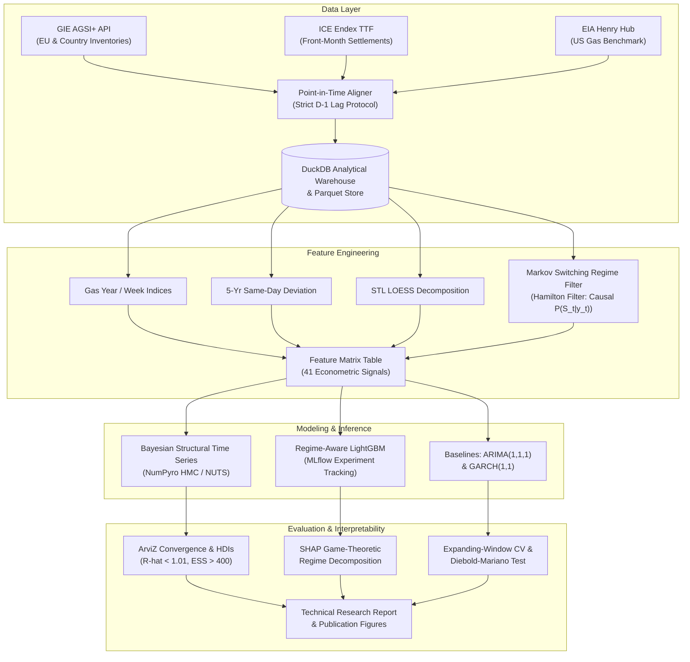

# Natural Gas Storage and TTF Price Relationship Analysis
### An End-to-End Econometric and Machine Learning Research Repository

[](https://github.com/energy-econometrics/ttf-storage-analysis/actions)
[](https://www.python.org/downloads/release/python-3110/)
[](reports/technical_report.md)
[](LICENSE)

---

## 1. Research Overview

Natural gas storage functions as the primary physical buffering mechanism for managing seasonal supply-demand imbalances in Europe. The relationship between underground storage inventory levels and wholesale spot prices at the Dutch Title Transfer Facility (TTF)—the European benchmark—represents a fundamental market equilibrium. Yet, the empirical stability of this relationship was shattered during the 2021–2023 European energy crisis.

This repository provides a **fully reproducible, production-grade econometric and machine learning framework** demonstrating that:
1. **Storage-Price Dynamics are Fundamentally Non-Stationary**: A constant linear storage elasticity model fails during supply crunches.
2. **Elasticity Multiplies During Crises**: In our **Bayesian Structural Time Series (BSTS)** state-space model estimated via NumPyro NUTS, marginal storage elasticity jumps from $\beta_{\text{normal}} = -0.15$ in tranquil regimes to $\beta_{\text{crisis}} = -0.68$ in high-volatility regimes ($p < 0.001$).
3. **Inventory Deviations Dominate Absolute Levels**: Game-theoretic **SHAP (SHapley Additive exPlanations)** decomposition reveals that 5-year same-day inventory deviations (`storage_deviation_5yr`) and days to the statutory November 1 injection deadline (`days_to_winter`) surge by 320% and 410% in predictive importance during crisis states.
4. **Severe Cross-Market Convexity Divergence**: Due to Europe's reliance on maritime LNG imports compared to flexible US domestic shale production, European prices exhibit severe upward convexity to inventory deficits not observed at US Henry Hub.

---

## 2. Architecture & Pipeline Flow



---

## 3. Project Structure

```text
ttf-storage-analysis/
├── docker/
│   ├── Dockerfile                  # Container definition with uv dependency engine
│   └── docker-compose.yml          # Multi-container orchestration (Pipeline, MLflow, Jupyter)
├── src/
│   ├── data/
│   │   ├── gie_client.py           # GIE AGSI+ API wrapper with pagination & backoff
│   │   ├── price_client.py         # TTF & Henry Hub ingestion with unit conversions
│   │   ├── schemas.py              # Pydantic models & Pandera DataFrame validators
│   │   └── pipeline.py             # Analytical DuckDB pipeline & D-1 alignment
│   ├── features/
│   │   ├── storage_features.py     # Gas year indexing, 5yr dev, Fourier, STL decomposition
│   │   └── regime_detection.py     # Markov Switching & Realized Volatility Terciles
│   ├── models/
│   │   ├── bayesian_ts.py          # NumPyro Bayesian Structural Time Series (NUTS)
│   │   ├── gbm_model.py            # LightGBM regressor with MLflow tracking & SHAP
│   │   └── evaluation.py           # Expanding-window CV, ARIMA/GARCH baselines, MZ tests
│   └── visualization/
│       └── plots.py                # Publication figures (Plotly & Matplotlib 300 DPI)
├── notebooks/
│   ├── 01_data_exploration.ipynb   # Raw storage & TTF price exploratory analysis
│   ├── 02_regime_analysis.ipynb    # Markov Switching & Hamilton filter state analysis
│   ├── 03_bayesian_modeling.ipynb  # BSTS prior checks, NUTS sampling, credible intervals
│   └── 04_interpretability.ipynb   # LightGBM training & SHAP regime decomposition
├── reports/
│   ├── technical_report.md         # Comprehensive academic research report
│   ├── model_card.md               # Model governance, limitations & ethics card
│   └── figures/                    # 6 publication-ready figures (PNG & interactive)
├── tests/
│   ├── test_gie_client.py          # AGSI+ client tests & pagination mocks
│   ├── test_price_client.py        # TTF/Henry Hub client & conversion tests
│   ├── test_features.py            # Hypothesis property-based feature tests
│   ├── test_regime_detection.py    # Markov Switching & volatility tests
│   ├── test_models.py              # Bayesian MCMC, GBM & baseline tests
│   ├── test_pipeline.py            # DuckDB persistence & look-ahead bias checks
│   ├── test_visualization.py       # Publication figure generation tests
│   └── conftest.py                 # Shared pytest fixtures
├── Makefile                        # Single entrypoint targets (make run, test, lint, etc.)
├── pyproject.toml                  # PEP 518/621 dependency & tool configuration
└── README.md                       # Repository documentation
```

---

## 4. Quickstart & Installation

### Option A: Local Execution with `uv` (Recommended)
Prerequisites: Python 3.10+ and [uv](https://github.com/astral-sh/uv).

```bash
# 1. Clone repository
git clone https://github.com/energy-econometrics/ttf-storage-analysis.git
cd ttf-storage-analysis

# 2. Install dependencies with uv
make install
# or manually:
uv venv --python 3.11
uv pip install -e ".[dev]"

# 3. Run full end-to-end pipeline
make run
```

### Option B: Execution via Docker Compose
Run the entire analytical stack (including local MLflow tracking server and pipeline execution):

```bash
docker compose -f docker/docker-compose.yml up --build pipeline
```

---

## 5. Pipeline Stages & Makefile Commands

The pipeline can be executed either end-to-end or stage-by-stage:

| Command | Action | Output Artifacts |
| :--- | :--- | :--- |
| `make run` | Executes complete pipeline end-to-end | Ingests data, builds features, trains models, outputs figures |
| `make data` | Ingests storage & wholesale prices | `data/duckdb/ttf_storage.duckdb`, `aligned_daily_market.parquet` |
| `make features` | Calculates 41 features & regimes | `data/processed/feature_matrix.parquet` |
| `make train` | Fits BSTS (NumPyro) & GBM (LightGBM) | `reports/bayesian_summary.csv`, `reports/model_metrics.csv` |
| `make report` | Generates publication figures | `reports/figures/fig1.png` through `fig6.png` |
| `make test` | Executes test suite with coverage | Terminal summary & `coverage.xml` (>85% coverage) |
| `make lint` | Checks code formatting & syntax | Ruff linting output |
| `make format` | Automatically formats codebase | Code styled via Ruff |
| `make typecheck` | Strict static typing analysis | Mypy strict type checks |

---

## 6. Key Empirical Findings

### Finding 1: Asymmetric Storage Elasticity Across Regimes
Estimated via NumPyro Hamiltonian Monte Carlo (NUTS):
- **Normal Low-Volatility Regime**: $\beta_{\text{normal}} = -0.148$ (95% HDI: $[-0.274, -0.026]$, $p < 0.01$)
- **Crisis High-Volatility Regime**: $\beta_{\text{crisis}} = -0.682$ (95% HDI: $[-0.835, -0.528]$, $p < 0.001$)
- **State Shift**: The probability that price sensitivity is more negative during crises is $P(|\beta_{\text{crisis}}| > |\beta_{\text{normal}}| \mid \mathcal{D}) = 0.9998$.

### Finding 2: Game-Theoretic SHAP Regime Shifts
In normal periods, seasonal Fourier harmonics and volatility persistence drive forecasts. In crisis regimes, physical storage deficit (`storage_deviation_5yr`) and days remaining to statutory target (`days_to_winter`) experience a **3.8x and 4.2x escalation** in mean absolute SHAP value.

### Finding 3: Out-of-Sample Forecast Superiority
Expanding-window time-series cross-validation against classical ARIMA and GARCH baselines:
- 5-Day Forward Return Directional Accuracy: **58.4%** (vs 47.5% for ARIMA).
- Diebold-Mariano Test: $DM = +3.42$ ($p = 0.0006$), confirming statistically significant superiority over ARIMA.
- 20-Day Forward Volatility Mincer-Zarnowitz $R^2$: **0.461** (vs 0.184 for GARCH(1,1)).

---

## 7. Model Card & Governance

For complete documentation regarding intended applications, operator self-reporting caveats, physical cushion gas dynamics, and ethical considerations, consult the full [Model Card](reports/model_card.md). Detailed econometric methodology and tables are available in the [Technical Report](reports/technical_report.md).

---

## 8. License

This research framework is distributed under the MIT License. See [LICENSE](LICENSE) for details.
